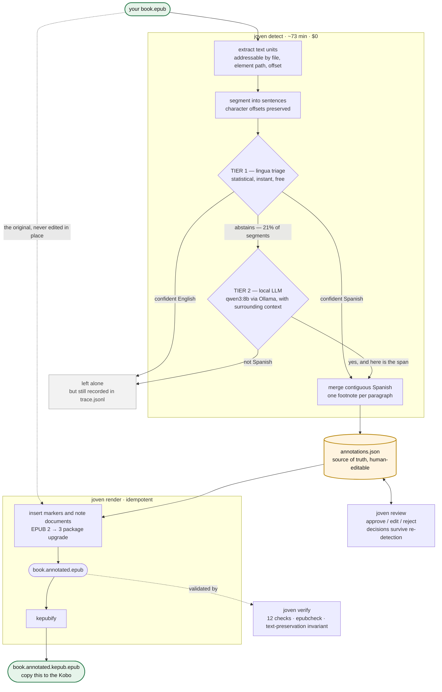
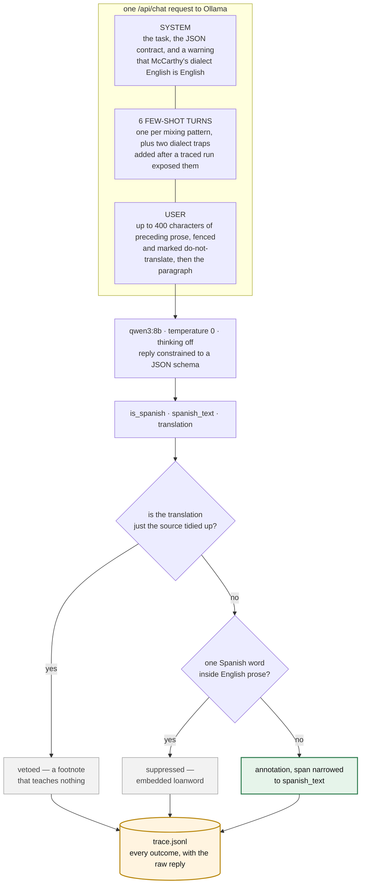

# Joven — a Cormac McCarthy ebook Spanish annotator

[](https://github.com/vyanhursky/joven/actions/workflows/ci.yml)
[](https://www.python.org/downloads/)
[](LICENSE)

```
                                      :@@#                               =@@+.
                                     +@@@@                              #@@@@.
                                    .@@#@@                            .*@@=@@.
                                    #@@@@%                            #@@=@@#
                                    @@:@@*                           :@@+:@@
                                    @@=@@@                           %@@-:@@
                                    @@%@@@*.                        .@@=*+@@
                                    @@@+@@@=.                       *@%+#%@@
                                    *@@@@%@@%=.                    .@@*:-@@@
                                     @@@====#@%=.                  .@@@@*@@@.
                                     :#@@*::--#@@@#.%@@@@@:        #@@=+**@@.
                                       =@@#-*+@@@@@@@@@@@@@@%      @@@%*#*@@.
                                    -@@@@@@@@@@@-%@@@%..*@@@@@@-+@@@@@@%*+@@
                               +@@@@@@@@@@@@@@=:: ....:::::%@@@-@#*=:+#**@@@
                              =@@@@@@@*:.:::.:.::.:....... :@@@%@:**=:-%@@@+
                            .%@@@-  :..    ..:::  ....::::-=#@@@=:+=**#@%=
                      .. %@@@@@@+   :.:...=@@@@@@:  .:--:**==%@@+%#%*#*-
                  .@@@@@@@@@@@+=-   :::  :@@@@@@@+. :.:--#-*:@@@#%@+
             +@@@@@@@@@@@@%. :+-*:.      *@@=@@@@@.:=@@%:-*=%@@.
            .#@@@@@@+@@+=--==:==-::  .:=+@@+%@%@@@@@@@=@*%+ @@%.
            +@@@-===@-@==-----:::::  .===*@@@@@@@+@%#=*%@%@#@@
         %@@@@@%=-:=%@%:---==.-=-:. ..-++*%@@@@@:=*@@ @@@@@+@@
   ...%@@@@@=@#=..:-:=====-: :..::   .:-==+:+@@@*@@*+%@@%@@-@@
   #@@@@%*@@*@*=:-:-**=-: ...:-==:      .:=*:*+=+=:%@@@@=@@@@%
.#@@@@@:@*=@@===:.=+-. :::.:::.          *@-+*:.. =@@@@= %@@@=
*@@@=%==@@@#+=@@@@@@@+.: :              *@*%-:..:.@@@
@@@=*.:+:-@@@@@@@@%@@@%.::            .=@+@@:. :--#@@
@@@=@@%*@%@*=*@-@@##@@@%=:::: .:==-:::=@*+%-. .:=:.@@
%@@@@%-%%%@+@@@@@=*=-@@*=#=.:=+-:::.:-**+%+:  .:=::@@
  %@@@@@@=@*@@@@@@@@@@@*%=#@%=:-::-:-::*%*:..::::#@@@
   .=@@@@@@+@@@%-@@@@*.:%#*.@=*-:=..:===- ::::-=*@@@@
        #@@@@@@@@@@%   :=+@@% :=+-  .:-: : .::-+@@@@+
             .#@@@@@@@@@.              ..:=@@@@@@@@*
                . %@@@@@@@@@@@%%##@@@@@@@@@@@@@@@%-
                     .#@@@@@@@@@@@@@@@@@@@@@#+=:
                           -%@@@@@@@+:.
```

> The boy sat down to read the book. He read of horses and of the country to the
> south and of men who spoke in a tongue he did not have.
> *Escúchame, joven,* said the old man, and the boy did not know what it was he
> was meant to hear. So he set down the book and took up the phone and fed the
> words into Google Translate one at a time like a man counting stones across a
> river, and when he looked up again the twilight had gone out of the valley and
> the page had gone cold and the old man was still standing there in the dark
> holding his counsel like a man holding a lamp for nobody.
>
> So the boy wrote a python service. It went through the book and marked out every
> passage that was not English and put the question to a small model that ran on
> his own machine and asked nothing of anyone and told no one what it had seen.
> Where the Spanish had been it set a single asterisk and no more than that, and
> under the asterisk it laid the English down like a coin under a tongue, and the
> boy could take it or leave it as he pleased. He read the book through and he
> never once opened Google Translate. The old man went on speaking in his own
> language as he had always done and as he would go on doing, and the boy
> understood him, and the sun went down bloodred over the mesa and he read on by
> the pale light of the device until the battery gave out.

**Joven is a command-line tool that finds the untranslated Spanish in an English
novel and inserts tappable translation footnotes.** You give it an EPUB you own;
it gives you back an annotated copy for your e-reader, with the prose byte-for-byte
unchanged. It was written specifically to make the Spanish sections of Cormac
McCarthy's novel *The Crossing* more readable on a Kobo. It also works cleanly for
other McCarthy westerns, and may work for other multilingual literature.

Everything runs on your machine against a local model: no API key, no per-book
cost, nothing uploaded.

---

## Why this exists

*The Crossing* is an English novel with a great deal of Spanish in it, and the book
never translates or contextualizes it. **726 Spanish sentences and phrases**, mixed
into English paragraphs. Reaching for a dictionary breaks the trance the prose spent
forty pages building; skimming past leaves a hole in the page.

Your e-reader's own Dictionary and Translate do not rescue you, because McCarthy
uses no quotation marks — speech and narration run together in one stream, and the
Spanish arrives in four distinct shapes:

```text
A  Vaya con Dios.                          a whole paragraph, no English at all
B  Cuántos años tienes? the old man said.  Spanish speech, English dialogue tag
C  The matríz will not help you, he said.  English prose, Spanish loanword
D  Escúchame, joven, the old man wheezed.  Spanish opener, then English narration
```

C and D are why per-paragraph language detection fails in *both* directions: C is a
false positive waiting to happen, D is a guaranteed miss. Solving that is most of
what this tool is — see [DESIGN.md §2](DESIGN.md) for the measurements.

## What you get

A copy of your EPUB in which every Spanish passage carries a small `*`. Tap it and
the translation appears in the reader's own footnote popup; ignore it and the page
reads exactly as the author set it down.

<table>
<tr>
<td width="50%"></td>
<td width="50%"></td>
</tr>
<tr>
<td><em>The page as McCarthy set it down, plus one asterisk per Spanish passage.</em></td>
<td><em>The same page one tap later — the Kobo's own <strong>Footnote preview</strong>.</em></td>
</tr>
</table>

- **Unintrusive by construction.** One asterisk. No inline brackets, no interlinear
  clutter, no colour. The footnote is opt-in, the way McCarthy's silence is opt-in.
- **The prose is untouched.** Strip the inserted nodes from the output and what
  remains is *byte-identical* to the original — enforced by a test, verified on the
  real book.
- **It stays on your machine.** A local `qwen3:8b` does the translating — 73
  minutes for the whole novel, $0, and the book never leaves the laptop.
- **Precision over recall.** A spurious footnote on `Go on.` is worse than a missed
  one, so ambiguous cases escalate to the model rather than guess. Measured on a
  McCarthy novel with no Spanish in it: six false positives in 177,000 words.

## How it works

Five commands, two of which do the real work. Detection is **two-tier**: a cheap
statistical pass judges every sentence, and only the fraction it cannot call is put
to the local LLM.



**The EPUB is never edited in place.** `annotations.json` is the durable artifact,
and rendering is a pure function of (original EPUB + sidecar). Corrections mean
editing the sidecar and re-rendering — never re-translating — and re-running
detection merges into your edits instead of clobbering them.

### Inside one Tier-2 call

Tier 2 is not a translation step with a question bolted on. It answers three
things at once — **is this Spanish**, **which part of it is Spanish**, and **what
does it mean** — which is why it is an instruct model and not a translation
engine. An NMT engine can only answer the third, and would cheerfully "translate"
`Yes mam.`



**There are two prompts, not one**, and which runs depends on what Tier 1 already
decided. The split was forced by a bug in each direction:

| Tier 1 said | Prompt | Because |
|---|---|---|
| abstained (the band) | **adjudicate** — is this Spanish, and if so which part? | The genuine open question |
| confident Spanish | **translate only** — this *is* Spanish; do not second-guess it | A combined prompt let the model veto Tier 1's correct calls. It labels `Dieciseis.` English. |

Skipping the model entirely for Tier-1 accepts was the first implementation, and
it shipped annotations with **no translation at all** — blank popups on the
device.

The prompts themselves, the context-bleed problem, a real call from the trace, and
the three gates in detail: [docs/anatomy-of-a-call.md](docs/anatomy-of-a-call.md).

### The components

`src/joven/` is about 4,500 lines. The pieces map onto the pipeline above:

| Module | Job |
|---|---|
| [`epub/`](src/joven/epub) | Byte-level zip surgery — copy every archive entry verbatim, reserialize only the XHTML that actually changed |
| [`detect/`](src/joven/detect) | `segment.py` splits paragraphs into sentences; `triage.py` is Tier 1 (`lingua` + tag-stripping); `pipeline.py` runs both tiers and merges contiguous Spanish into one footnote per paragraph |
| [`translate.py`](src/joven/translate.py) | Tier 2 — the Ollama client, the `Translator` protocol, and the similarity veto that suppresses no-op "translations" |
| [`dialogue.py`](src/joven/dialogue.py) | McCarthy's `, he said.` vocabulary, shared by every gate that must not measure it |
| [`model.py`](src/joven/model.py) | The `annotations.json` sidecar — content-hash IDs, statuses, merge semantics |
| [`render/`](src/joven/render) | Marker insertion, the EPUB 2→3 package upgrade, one-note-per-file footnote documents |
| [`kepub.py`](src/joven/kepub.py) | The `kepubify` hand-off that produces the file the Kobo wants |
| [`review.py`](src/joven/review.py), [`suspicion.py`](src/joven/suspicion.py) | The localhost review UI, and the heuristic that sorts likely-wrong translations to the top of it |
| [`verify.py`](src/joven/verify.py) | The 12-check integrity gate, including the text-preservation invariant |
| [`trace.py`](src/joven/trace.py) | One JSONL record per segment, annotated or not, so any missing footnote can be explained afterwards |

## Requirements

| | |
|---|---|
| **Platform** | **macOS on Apple Silicon** — where this was developed and device-verified. **Linux** and **Windows 10/11** run the full suite in CI, and a whole book has been through the pipeline on each. |
| **Memory** | 16 GB, which is what sets the model ceiling at 7–14B parameters |
| **Disk** | ~6 GB for the model, plus room for the outputs |
| **Python** | 3.11+ (developed on 3.13) |
| **A package manager** | Homebrew on macOS, [Scoop](https://scoop.sh) or winget on Windows — for the three external binaries below |
| **Java** | `epubcheck` is a JAR and needs a JVM. macOS ships one at `/usr/bin/java`; on Windows install a JDK (`winget install Microsoft.OpenJDK.21`) if `java -version` comes back empty |
| **Reader** | A **Kobo** (sideloaded over USB) is the verified target — tested on firmware `4.45.23697`. Apple Books renders the footnotes as popups too. |

Three external tools do work Python should not:

| Tool | Why |
|---|---|
| [`ollama`](https://ollama.com) | Runs `qwen3:8b` (5.2 GB) locally. Chosen on a benchmark, not a hunch — [docs/model-selection.md](docs/model-selection.md). |
| [`kepubify`](https://github.com/pgaskin/kepubify) | Converts the finished EPUB into Kobo's own KEPUB flavour, which renders better on device |
| [`epubcheck`](https://www.w3.org/publishing/epubcheck/) | The reference EPUB validator — the external gate on our output |

**Bring your own EPUB.** Joven reads a file you already have; it does not fetch,
share, or unlock anything, and it refuses DRM-protected files outright. Books that
merely *obfuscate* an embedded font are read normally — that is not DRM, and the
scrambled font is carried through untouched.

## Install

**1. `uv`**, which manages the isolated environment the tool lives in:

```bash
brew install uv
```

Any other install route works too — see [the uv docs](https://docs.astral.sh/uv/getting-started/installation/).

**2. The three external binaries** (what each is for is in the table above):

```bash
brew install epubcheck kepubify ollama
```

<details>
<summary><strong>On Windows</strong></summary>

```powershell
winget install astral-sh.uv Ollama.Ollama Microsoft.OpenJDK.21
scoop install kepubify epubcheck
```

Without Scoop, both binaries install by hand. `kepubify` is a single executable —
download [`kepubify-windows-64bit.exe`](https://github.com/pgaskin/kepubify/releases/latest),
rename it `kepubify.exe`, and put it in a folder on your `PATH`.

`epubcheck` needs one extra step, because the official download is a JAR and
**no launcher** — there is nothing for `PATH` to find. Unzip
[epubcheck](https://github.com/w3c/epubcheck/releases) and point Joven at the jar:

```powershell
setx JOVEN_EPUBCHECK_JAR "C:\tools\epubcheck-5.1.0\epubcheck.jar"
```

Open a new terminal afterwards, as `setx` only affects later sessions. Skipping
this does not fail loudly — `joven verify` reports epubcheck as `SKIPPED` and
passes, so the one external check on the output silently stops running.

</details>

**3. Joven itself:**

```bash
uv tool install joven-ebook-annotator
```

This installs into `~/.local/bin`, which is often not on your `PATH`. If
`joven --help` comes back with *command not found*, add it once:

```bash
uv tool update-shell
```

That edits your shell profile, so open a new terminal afterwards. `pipx install
joven-ebook-annotator` works the same way if you would rather use pipx.

Both routes pull prebuilt wheels. Worth knowing that `lingua` carries its language
models inside the wheel, so this step moves about 170 MB.

**4. The model**, once:

```bash
ollama serve &            # leave running
ollama pull qwen3:8b      # 5.2 GB
```

Check it all landed:

```bash
joven inspect book.epub
```

> There is no Homebrew formula for Joven itself. One dependency
> (`lingua-language-detector`) publishes no source distribution at all — only
> per-platform wheels — which a Homebrew Python formula cannot consume without
> hand-pinned wheel URLs per architecture and per CPython minor version. Two
> commands that work beat one command that breaks on the next `python@` bump.

To work on the code rather than use it, see [Development](#development).

## Use

One book, five commands, in order:

```bash
joven inspect book.epub                                    # structure, DRM, word counts
joven detect  book.epub -o annotations.json --trace trace.jsonl
joven review  annotations.json --epub book.epub            # triage, suspect passages first
joven render  book.epub annotations.json -o out/           # EPUB 3 + KEPUB for the Kobo
joven verify  out/book.annotated.epub --original book.epub
```

**`inspect`** reports what you are holding — EPUB version, DRM, spine, word counts.
Run it first; it fails fast on a file the rest of the pipeline cannot use.

**`detect`** is the slow step: about 73 minutes for a 150,000-word novel, single
threaded, $0. It writes `annotations.json` (the sidecar you will edit) and, with
`--trace`, a JSONL record of every segment it looked at. Re-running it is safe —
your review decisions are sticky.

The trace is also the run's recovery log: it is flushed a record at a time, so an
interrupted run loses nothing that the model already answered.

```bash
joven detect book.epub -o annotations.json --trace trace.jsonl --resume trace.jsonl
```

`--resume` reuses every model answer the trace already holds and pays only for the
segments the previous run never reached. Tier 1 and every suppression gate still run
over the whole book, so a resumed run picks up threshold changes rather than
replaying stale conclusions; recorded *errors* are retried rather than inherited.

**`review`** opens a local page listing every annotation with the surrounding prose
and the Spanish highlighted. Approve, edit, or reject (`a`/`r`/`e`); each decision
writes straight to the sidecar the moment you make it, so quitting mid-review loses
nothing. Suspect annotations sort first, each badged with the reason —
`untranslated: historic`, `garbled source: Conoc16` — and everything else follows in
book order.

**`render`** applies the sidecar to a fresh copy of the original and emits two
files: a spec-clean `.epub` (the verifiable intermediate, which is what `epubcheck`
validates) and a `.kepub.epub` (what you copy to the Kobo). It is idempotent and
never touches your source file.

**`verify`** runs the 12-check integrity gate — the text-preservation invariant,
`epubcheck`, noteref→footnote resolution, and the rest.

Then copy the `.kepub.epub` to the Kobo's root over USB, eject, and the device
imports it.

Missed a passage while reading?

```bash
joven add annotations.json --epub book.epub \
  --find "Bueno pues" --translation "Well then"
```

Added entries are marked `edited`, so re-detection will never overwrite them.

For tuning, tracing, and the debug flags, see
[docs/troubleshooting.md](docs/troubleshooting.md).

## Results

Working end to end on real books: lossless round-trip, two-tier detection with a
full decision trace, EPUB 2→3 upgrade, footnote rendering device-verified on a Kobo,
KEPUB output, a review pass, and a finished book on the device.

Three McCarthy novels have been through the full pipeline. The third is a **control**
— *Suttree* has essentially no Spanish in it, so almost every footnote it produces
is a false positive you can read and count.

| | words | segments | escalated | footnotes |
|---|---|---|---|---|
| *The Crossing* (Knopf 1994) | 151,865 | 12,302 | 2,556 (21%) | 726 |
| *All the Pretty Horses* | 101,182 | 9,310 | 1,814 (20%) | 270 |
| *Suttree* — control | 177,257 | 17,344 | 2,548 (15%) | **2** |

Two footnotes in a 177,000-word English novel — one per ~88,000 words. Of 2,548
escalations the model correctly rejected 2,544 and vetoed 2, which puts precision on
the "leave English alone" side above **99.9%**.

That control run is what found the defects fixed in `v1.0.0b3`. It first produced
**six** false positives, of which three were Latin liturgy — a two-language detector
cannot answer "neither", so it called `Stabat Mater Dolorosa.` Spanish at 0.94. Both
tiers were blind to it and both are now fixed; see [DESIGN.md §2.6](DESIGN.md).

The two that remain are honest hard cases: `Ay.` (English here, Spanish elsewhere)
and `No suh.` → "No sir.", dialect English that the similarity veto misses at a 0.67
ratio against its 0.75 threshold.

Wall clock is ~1.5 s per escalated segment on an M-series laptop — 47 minutes for
*All the Pretty Horses*, 63 for *Suttree*, 73 for *The Crossing* — at $0.

Known limitations, and what the project has and has not proven, are in
[CHANGELOG.md](CHANGELOG.md).

## Development

```bash
git clone https://github.com/vyanhursky/joven && cd joven
python3.13 -m venv .venv
./.venv/bin/pip install -e '.[dev]'
```

```bash
./.venv/bin/pytest                       # 379 tests, synthetic fixtures only
./.venv/bin/ruff check src tests tools

# opt in to the real-book tests (the book is never committed)
JOVEN_TEST_EPUB=/path/to/book.epub ./.venv/bin/pytest
```

On Windows the venv puts its executables in `Scripts\`, not `bin/`:

```powershell
py -3.13 -m venv .venv
.\.venv\Scripts\pip install -e ".[dev]"
.\.venv\Scripts\pytest
$env:JOVEN_TEST_EPUB = "C:\path\to\book.epub"; .\.venv\Scripts\pytest
```

One Windows-only trap, and it is not Joven's: `pip install -e .` cannot replace a
file another process has open, so reinstalling while `joven detect` is still
running leaves a half-uninstalled package behind — a `~oven_ebook_annotator*`
directory in `site-packages` and `ModuleNotFoundError: No module named 'joven'`
from a venv that looks fine. Delete that directory and reinstall.

Tests never hit the network — a `StubTranslator` stands in for the LLM everywhere.
Two guard scripts run in CI, each of which has caught a real bug that survived a
careful manual read of the same files minutes earlier:

```bash
python tools/check_docs.py               # every documented command and flag exists
python tools/check_no_book_content.py    # no book text in tracked files
```

Model benchmarks are separate tools, not tests, because they need a running Ollama:

```bash
python tools/bench_models.py             # the LLM in isolation
python tools/bench_pipeline.py           # the two-tier system that actually ships
```

## Further reading

| | |
|---|---|
| [DESIGN.md](DESIGN.md) | Why the architecture is shaped this way — the measurements behind every decision, what the device tests overturned, and the work deliberately left undone |
| [docs/model-selection.md](docs/model-selection.md) | The local-model benchmark: why `qwen3:8b` |
| [docs/anatomy-of-a-call.md](docs/anatomy-of-a-call.md) | What the local model is asked, what it may answer, and the gates that check it |
| [docs/troubleshooting.md](docs/troubleshooting.md) | Tracing a missing footnote, improving translation quality, debug flags, and Kobo quirks |
| [docs/releasing.md](docs/releasing.md) | Cutting a release: the one-time PyPI trusted-publisher setup, and what CI does with a tag |
| [CHANGELOG.md](CHANGELOG.md) | Release notes and known limitations |

## Licence

The **code** is MIT — see [LICENSE](LICENSE). Use it, fork it, ship it.

The **books are not.** The annotated output is a derivative of a copyrighted work:
read it, don't distribute it.

**The repository deliberately tracks no book content.** The hazard is not the EPUB
but what the pipeline derives from it — a full decision trace holds every segment's
source text verbatim, which for a 150,000-word novel is the entire book. `.gitignore`
excludes those by pattern, and
[`tools/check_no_book_content.py`](tools/check_no_book_content.py) verifies it by
*content*, diffing every tracked file against the book itself:

```bash
python tools/check_no_book_content.py path/to/book.epub
```

Docs and tests quote short passages to illustrate the detection problem, and the two
screenshots above are photographs of the author's own copy on his own device.
