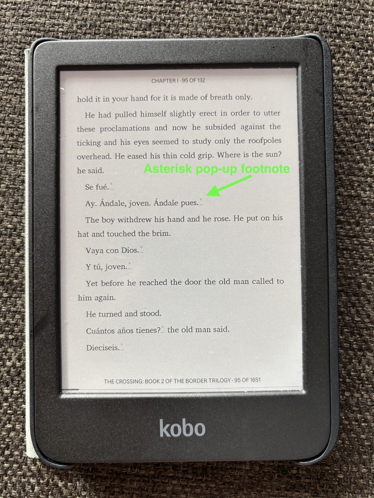
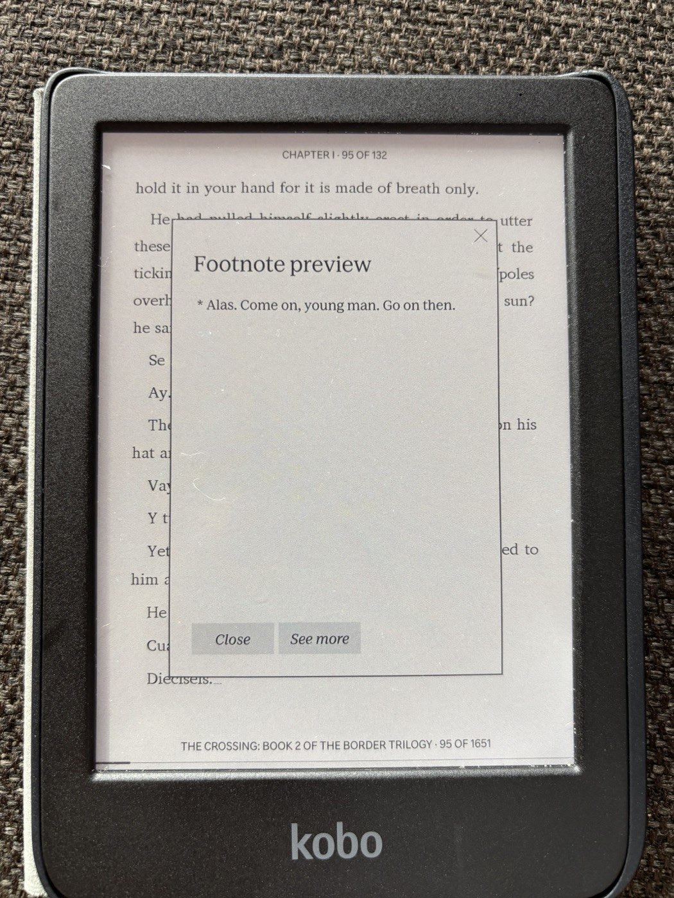

# Joven — a Cormac McCarthy ebook Spanish annotator

[](https://github.com/vyanhursky/joven/actions/workflows/ci.yml)
[](https://www.python.org/downloads/)
[](LICENSE)

```
                                      :@@#                               =@@+.
                                     +@@@@                              #@@@@.
                                    .@@#@@                            .*@@=@@.
                                    #@@@@%                            #@@=@@#
                                    @@:@@*                           :@@+:@@
                                    @@=@@@                           %@@-:@@
                                    @@%@@@*.                        .@@=*+@@
                                    @@@+@@@=.                       *@%+#%@@
                                    *@@@@%@@%=.                    .@@*:-@@@
                                     @@@====#@%=.                  .@@@@*@@@.
                                     :#@@*::--#@@@#.%@@@@@:        #@@=+**@@.
                                       =@@#-*+@@@@@@@@@@@@@@%      @@@%*#*@@.
                                    -@@@@@@@@@@@-%@@@%..*@@@@@@-+@@@@@@%*+@@
                               +@@@@@@@@@@@@@@=:: ....:::::%@@@-@#*=:+#**@@@
                              =@@@@@@@*:.:::.:.::.:....... :@@@%@:**=:-%@@@+
                            .%@@@-  :..    ..:::  ....::::-=#@@@=:+=**#@%=
                      .. %@@@@@@+   :.:...=@@@@@@:  .:--:**==%@@+%#%*#*-
                  .@@@@@@@@@@@+=-   :::  :@@@@@@@+. :.:--#-*:@@@#%@+
             +@@@@@@@@@@@@%. :+-*:.      *@@=@@@@@.:=@@%:-*=%@@.
            .#@@@@@@+@@+=--==:==-::  .:=+@@+%@%@@@@@@@=@*%+ @@%.
            +@@@-===@-@==-----:::::  .===*@@@@@@@+@%#=*%@%@#@@
         %@@@@@%=-:=%@%:---==.-=-:. ..-++*%@@@@@:=*@@ @@@@@+@@
   ...%@@@@@=@#=..:-:=====-: :..::   .:-==+:+@@@*@@*+%@@%@@-@@
   #@@@@%*@@*@*=:-:-**=-: ...:-==:      .:=*:*+=+=:%@@@@=@@@@%
.#@@@@@:@*=@@===:.=+-. :::.:::.          *@-+*:.. =@@@@= %@@@=
*@@@=%==@@@#+=@@@@@@@+.: :              *@*%-:..:.@@@
@@@=*.:+:-@@@@@@@@%@@@%.::            .=@+@@:. :--#@@
@@@=@@%*@%@*=*@-@@##@@@%=:::: .:==-:::=@*+%-. .:=:.@@
%@@@@%-%%%@+@@@@@=*=-@@*=#=.:=+-:::.:-**+%+:  .:=::@@
  %@@@@@@=@*@@@@@@@@@@@*%=#@%=:-::-:-::*%*:..::::#@@@
   .=@@@@@@+@@@%-@@@@*.:%#*.@=*-:=..:===- ::::-=*@@@@
        #@@@@@@@@@@%   :=+@@% :=+-  .:-: : .::-+@@@@+
             .#@@@@@@@@@.              ..:=@@@@@@@@*
                . %@@@@@@@@@@@%%##@@@@@@@@@@@@@@@%-
                     .#@@@@@@@@@@@@@@@@@@@@@#+=:
                           -%@@@@@@@+:.
```

> The boy sat down to read the book. He read of horses and of the country to the
> south and of men who spoke in a tongue he did not have.
> *Escúchame, joven,* said the old man, and the boy did not know what it was he
> was meant to hear. So he set down the book and took up the phone and fed the
> words into Google Translate one at a time like a man counting stones across a
> river, and when he looked up again the twilight had gone out of the valley and
> the page had gone cold and the old man was still standing there in the dark
> holding his counsel like a man holding a lamp for nobody.
>
> So the boy wrote a python service. It went through the book and marked out every
> passage that was not English and put the question to a small model that ran on
> his own machine and asked nothing of anyone and told no one what it had seen.
> Where the Spanish had been it set a single asterisk and no more than that, and
> under the asterisk it laid the English down like a coin under a tongue, and the
> boy could take it or leave it as he pleased. He read the book through and he
> never once opened Google Translate. The old man went on speaking in his own
> language as he had always done and as he would go on doing, and the boy
> understood him, and the sun went down bloodred over the mesa and he read on by
> the pale light of the device until the battery gave out.

**Joven is a command-line tool that finds the untranslated Spanish in an English
novel and inserts tappable translation footnotes.** You give it an EPUB you own;
it gives you back an annotated copy for your e-reader, with the prose byte-for-byte
unchanged. It was written for Cormac McCarthy's *The Crossing* and works well on
his other westerns.

Everything runs on your machine against a local model: no API key, no per-book
cost, nothing uploaded.

---

## Why this exists

*The Crossing* is an English novel with a great deal of Spanish in it, and the book
never translates or contextualizes it. **726 Spanish sentences and phrases**, mixed
into English paragraphs. Reaching for a dictionary breaks the trance the prose spent
forty pages building; skimming past leaves a hole in the page.

Your e-reader's own Dictionary and Translate do not rescue you, because McCarthy
uses no quotation marks — speech and narration run together in one stream, and the
Spanish arrives in four distinct shapes:

```text
A  Vaya con Dios.                          a whole paragraph, no English at all
B  Cuántos años tienes? the old man said.  Spanish speech, English dialogue tag
C  The matríz will not help you, he said.  English prose, Spanish loanword
D  Escúchame, joven, the old man wheezed.  Spanish opener, then English narration
```

C and D are why per-paragraph language detection fails in *both* directions: C is a
false positive waiting to happen, D is a guaranteed miss. Solving that is most of
what this tool is — see [DESIGN.md §2](DESIGN.md) for the measurements.

## What you get

A copy of your EPUB in which every Spanish passage carries a small `*`. Tap it and
the translation appears in the reader's own footnote popup; ignore it and the page
reads exactly as the author set it down.

<table>
<tr>
<td width="50%"></td>
<td width="50%"></td>
</tr>
<tr>
<td><em>The page as McCarthy set it down, plus one asterisk per Spanish passage.</em></td>
<td><em>The same page one tap later — the Kobo's own <strong>Footnote preview</strong>.</em></td>
</tr>
</table>

- **Unintrusive by construction.** One asterisk. No inline brackets, no interlinear
  clutter, no colour. The footnote is opt-in, the way McCarthy's silence is opt-in.
- **The prose is untouched.** Strip the inserted nodes from the output and what
  remains is *byte-identical* to the original — enforced by a test, verified on the
  real book.
- **It stays on your machine.** A local `qwen3:8b` does the translating — 73
  minutes for the whole novel, $0, and the book never leaves the laptop.
- **Precision over recall.** A spurious footnote on `Go on.` is worse than a missed
  one, so ambiguous cases escalate to the model rather than guess.

## How it works

Five commands, two of which do the real work. Detection is **two-tier**: a cheap
statistical pass judges every sentence, and only the fraction it cannot call is put
to the local LLM.


**The EPUB is never edited in place.** `annotations.json` is the durable artifact,
and rendering is a pure function of (original EPUB + sidecar). Corrections mean
editing the sidecar and re-rendering — never re-translating — and re-running
detection merges into your edits instead of clobbering them.

### The components

`src/joven/` is about 4,500 lines. The pieces map onto the pipeline above:

| Module | Job |
|---|---|
| [`epub/`](src/joven/epub) | Byte-level zip surgery — copy every archive entry verbatim, reserialize only the XHTML that actually changed |
| [`detect/`](src/joven/detect) | `segment.py` splits paragraphs into sentences; `triage.py` is Tier 1 (`lingua` + tag-stripping); `pipeline.py` runs both tiers and merges contiguous Spanish into one footnote per paragraph |
| [`translate.py`](src/joven/translate.py) | Tier 2 — the Ollama client, the `Translator` protocol, and the similarity veto that suppresses no-op "translations" |
| [`dialogue.py`](src/joven/dialogue.py) | McCarthy's `, he said.` vocabulary, shared by every gate that must not measure it |
| [`model.py`](src/joven/model.py) | The `annotations.json` sidecar — content-hash IDs, statuses, merge semantics |
| [`render/`](src/joven/render) | Marker insertion, the EPUB 2→3 package upgrade, one-note-per-file footnote documents |
| [`kepub.py`](src/joven/kepub.py) | The `kepubify` hand-off that produces the file the Kobo wants |
| [`review.py`](src/joven/review.py), [`suspicion.py`](src/joven/suspicion.py) | The localhost review UI, and the heuristic that sorts likely-wrong translations to the top of it |
| [`verify.py`](src/joven/verify.py) | The 12-check integrity gate, including the text-preservation invariant |
| [`trace.py`](src/joven/trace.py) | One JSONL record per segment, annotated or not, so any missing footnote can be explained afterwards |

## Requirements

| | |
|---|---|
| **Platform** | **macOS on Apple Silicon** — where this was developed and device-verified. CI also runs the suite on Linux. Windows is untested. |
| **Memory** | 16 GB, which is what sets the model ceiling at 7–14B parameters |
| **Disk** | ~6 GB for the model, plus room for the outputs |
| **Python** | 3.11+ (developed on 3.13) |
| **Homebrew** | for the three external binaries below |
| **Java** | `epubcheck` is a JAR and needs a JVM; macOS ships one at `/usr/bin/java` |
| **Reader** | A **Kobo** (sideloaded over USB) is the verified target — tested on firmware `4.45.23697`. Apple Books renders the footnotes as popups too. |

Three external tools do work Python should not:

| Tool | Why |
|---|---|
| [`ollama`](https://ollama.com) | Runs `qwen3:8b` (5.2 GB) locally. Chosen on a benchmark, not a hunch — [docs/model-selection.md](docs/model-selection.md). |
| [`kepubify`](https://github.com/pgaskin/kepubify) | Converts the finished EPUB into Kobo's own KEPUB flavour, which renders better on device |
| [`epubcheck`](https://www.w3.org/publishing/epubcheck/) | The reference EPUB validator — the external gate on our output |

**Bring your own EPUB.** Joven reads a file you already have; it does not fetch,
share, or unlock anything, and it refuses DRM-protected files outright.

## Install

```bash
brew install epubcheck kepubify ollama
python3.13 -m venv .venv
./.venv/bin/pip install -e '.[dev]'

ollama serve &            # once
ollama pull qwen3:8b      # 5.2 GB
```

## Use

One book, five commands, in order:

```bash
joven inspect book.epub                                    # structure, DRM, word counts
joven detect  book.epub -o annotations.json --trace trace.jsonl
joven review  annotations.json --epub book.epub            # triage, suspect passages first
joven render  book.epub annotations.json -o out/           # EPUB 3 + KEPUB for the Kobo
joven verify  out/book.annotated.epub --original book.epub
```

**`inspect`** reports what you are holding — EPUB version, DRM, spine, word counts.
Run it first; it fails fast on a file the rest of the pipeline cannot use.

**`detect`** is the slow step: about 73 minutes for a 150,000-word novel, single
threaded, $0. It writes `annotations.json` (the sidecar you will edit) and, with
`--trace`, a JSONL record of every segment it looked at. Re-running it is safe —
your review decisions are sticky.

**`review`** opens a local page listing every annotation with the surrounding prose
and the Spanish highlighted. Approve, edit, or reject (`a`/`r`/`e`); each decision
writes straight to the sidecar the moment you make it, so quitting mid-review loses
nothing. Suspect annotations sort first, each badged with the reason —
`untranslated: historic`, `garbled source: Conoc16` — and everything else follows in
book order.

**`render`** applies the sidecar to a fresh copy of the original and emits two
files: a spec-clean `.epub` (the verifiable intermediate, which is what `epubcheck`
validates) and a `.kepub.epub` (what you copy to the Kobo). It is idempotent and
never touches your source file.

**`verify`** runs the 12-check integrity gate — the text-preservation invariant,
`epubcheck`, noteref→footnote resolution, and the rest.

Then copy the `.kepub.epub` to the Kobo's root over USB, eject, and the device
imports it.

Missed a passage while reading?

```bash
joven add annotations.json --epub book.epub \
  --find "Bueno pues" --translation "Well then"
```

Added entries are marked `edited`, so re-detection will never overwrite them.

For tuning, tracing, and the debug flags, see
[docs/troubleshooting.md](docs/troubleshooting.md).

## Results

Working end to end on a real book: lossless round-trip, two-tier detection with a
full decision trace, EPUB 2→3 upgrade, footnote rendering device-verified on a Kobo,
KEPUB output, a review pass, and a finished book on the device.

Last full run — Knopf's 1994 edition of *The Crossing*, 151,865 words:

| | |
|---|---|
| segments considered | 12,302 |
| escalated to the LLM | 2,556 (21%) |
| footnotes produced | 726 |
| wall clock / cost | 73 minutes / $0 |
| integrity checks | 12 of 12 passing |

Known limitations, and what the project has and has not proven, are in
[CHANGELOG.md](CHANGELOG.md).

## Development

```bash
./.venv/bin/pytest                       # 353 tests, synthetic fixtures only
./.venv/bin/ruff check src tests tools

# opt in to the real-book tests (the book is never committed)
JOVEN_TEST_EPUB=/path/to/book.epub ./.venv/bin/pytest
```

Tests never hit the network — a `StubTranslator` stands in for the LLM everywhere.
Two guard scripts run in CI, each of which has caught a real bug that survived a
careful manual read of the same files minutes earlier:

```bash
python tools/check_docs.py               # every documented command and flag exists
python tools/check_no_book_content.py    # no book text in tracked files
```

Model benchmarks are separate tools, not tests, because they need a running Ollama:

```bash
python tools/bench_models.py             # the LLM in isolation
python tools/bench_pipeline.py           # the two-tier system that actually ships
```

## Further reading

| | |
|---|---|
| [DESIGN.md](DESIGN.md) | Why the architecture is shaped this way — the measurements behind every decision, what the device tests overturned, and the work deliberately left undone |
| [docs/model-selection.md](docs/model-selection.md) | The local-model benchmark: why `qwen3:8b` |
| [docs/troubleshooting.md](docs/troubleshooting.md) | Tracing a missing footnote, improving translation quality, debug flags, and Kobo quirks |
| [CHANGELOG.md](CHANGELOG.md) | Release notes and known limitations |

## Licence

The **code** is MIT — see [LICENSE](LICENSE). Use it, fork it, ship it.

The **books are not.** The annotated output is a derivative of a copyrighted work:
read it, don't distribute it.

**The repository deliberately tracks no book content.** The hazard is not the EPUB
but what the pipeline derives from it — a full decision trace holds every segment's
source text verbatim, which for a 150,000-word novel is the entire book. `.gitignore`
excludes those by pattern, and
[`tools/check_no_book_content.py`](tools/check_no_book_content.py) verifies it by
*content*, diffing every tracked file against the book itself:

```bash
python tools/check_no_book_content.py path/to/book.epub
```

Docs and tests quote short passages to illustrate the detection problem, and the two
screenshots above are photographs of the author's own copy on his own device.
