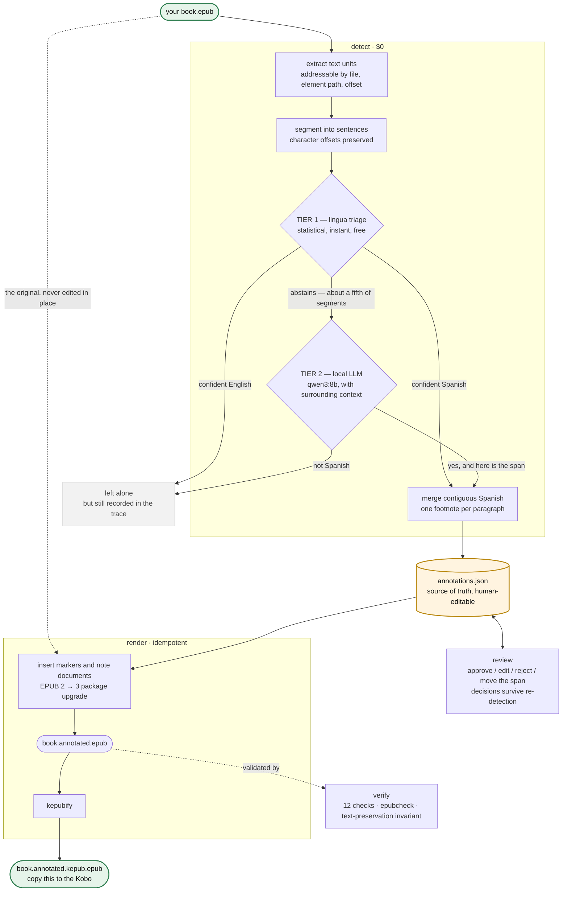
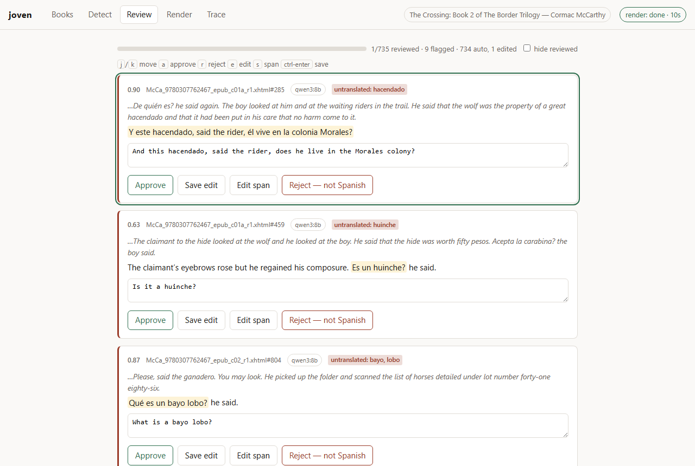

# Joven — a Cormac McCarthy ebook Spanish annotator

[](https://github.com/vyanhursky/joven/actions/workflows/ci.yml)
[](https://pypi.org/project/joven-ebook-annotator/)
[](https://www.python.org/downloads/)
[](LICENSE)

```
                                      :@@#                               =@@+.
                                     +@@@@                              #@@@@.
                                    .@@#@@                            .*@@=@@.
                                    #@@@@%                            #@@=@@#
                                    @@:@@*                           :@@+:@@
                                    @@=@@@                           %@@-:@@
                                    @@%@@@*.                        .@@=*+@@
                                    @@@+@@@=.                       *@%+#%@@
                                    *@@@@%@@%=.                    .@@*:-@@@
                                     @@@====#@%=.                  .@@@@*@@@.
                                     :#@@*::--#@@@#.%@@@@@:        #@@=+**@@.
                                       =@@#-*+@@@@@@@@@@@@@@%      @@@%*#*@@.
                                    -@@@@@@@@@@@-%@@@%..*@@@@@@-+@@@@@@%*+@@
                               +@@@@@@@@@@@@@@=:: ....:::::%@@@-@#*=:+#**@@@
                              =@@@@@@@*:.:::.:.::.:....... :@@@%@:**=:-%@@@+
                            .%@@@-  :..    ..:::  ....::::-=#@@@=:+=**#@%=
                      .. %@@@@@@+   :.:...=@@@@@@:  .:--:**==%@@+%#%*#*-
                  .@@@@@@@@@@@+=-   :::  :@@@@@@@+. :.:--#-*:@@@#%@+
             +@@@@@@@@@@@@%. :+-*:.      *@@=@@@@@.:=@@%:-*=%@@.
            .#@@@@@@+@@+=--==:==-::  .:=+@@+%@%@@@@@@@=@*%+ @@%.
            +@@@-===@-@==-----:::::  .===*@@@@@@@+@%#=*%@%@#@@
         %@@@@@%=-:=%@%:---==.-=-:. ..-++*%@@@@@:=*@@ @@@@@+@@
   ...%@@@@@=@#=..:-:=====-: :..::   .:-==+:+@@@*@@*+%@@%@@-@@
   #@@@@%*@@*@*=:-:-**=-: ...:-==:      .:=*:*+=+=:%@@@@=@@@@%
.#@@@@@:@*=@@===:.=+-. :::.:::.          *@-+*:.. =@@@@= %@@@=
*@@@=%==@@@#+=@@@@@@@+.: :              *@*%-:..:.@@@
@@@=*.:+:-@@@@@@@@%@@@%.::            .=@+@@:. :--#@@
@@@=@@%*@%@*=*@-@@##@@@%=:::: .:==-:::=@*+%-. .:=:.@@
%@@@@%-%%%@+@@@@@=*=-@@*=#=.:=+-:::.:-**+%+:  .:=::@@
  %@@@@@@=@*@@@@@@@@@@@*%=#@%=:-::-:-::*%*:..::::#@@@
   .=@@@@@@+@@@%-@@@@*.:%#*.@=*-:=..:===- ::::-=*@@@@
        #@@@@@@@@@@%   :=+@@% :=+-  .:-: : .::-+@@@@+
             .#@@@@@@@@@.              ..:=@@@@@@@@*
                . %@@@@@@@@@@@%%##@@@@@@@@@@@@@@@%-
                     .#@@@@@@@@@@@@@@@@@@@@@#+=:
                           -%@@@@@@@+:.
```

> The boy sat down to read the book. He read of horses and of the country to the
> south and of men who spoke in a tongue he did not have.
> *Escúchame, joven,* said the old man, and the boy did not know what it was he
> was meant to hear. So he set down the book and took up the phone and fed the
> words into Google Translate one at a time like a man counting stones across a
> river, and when he looked up again the twilight had gone out of the valley and
> the page had gone cold and the old man was still standing there in the dark
> holding his counsel like a man holding a lamp for nobody.
>
> So the boy wrote a python service. It went through the book and marked out every
> passage that was not English and put the question to a small model that ran on
> his own machine and asked nothing of anyone and told no one what it had seen.
> Where the Spanish had been it set a single asterisk and no more than that, and
> under the asterisk it laid the English down like a coin under a tongue, and the
> boy could take it or leave it as he pleased. He read the book through and he
> never once opened Google Translate. The old man went on speaking in his own
> language as he had always done and as he would go on doing, and the boy
> understood him, and the sun went down bloodred over the mesa and he read on by
> the pale light of the device until the battery gave out.

**Joven finds the untranslated Spanish in an English novel and inserts tappable
translation footnotes.** You give it an EPUB you own; it gives you back an annotated
copy for your e-reader, with the prose byte-for-byte unchanged. Everything runs on
your machine against a local model: no API key, no per-book cost, nothing uploaded.

It was written to make Cormac McCarthy's *The Crossing* readable on a Kobo, and
has since been through the rest of the Border Trilogy. Use it from a local web page
that runs the whole workflow, or from the command line, or both — they share the
same files.

<table>
<tr>
<td width="50%"></td>
<td width="50%"></td>
</tr>
<tr>
<td><em>The page as McCarthy set it down, plus one asterisk per Spanish passage.</em></td>
<td><em>The same page one tap later — the Kobo's own <strong>Footnote preview</strong>.</em></td>
</tr>
</table>

---

## Why this exists

*The Crossing* is an English novel with a great deal of Spanish in it, and the book
never translates or contextualises it — some 730 Spanish sentences and phrases mixed
into English paragraphs. Reaching for a dictionary breaks the trance the prose spent
forty pages building; skimming past leaves a hole in the page.

Your e-reader's own Dictionary and Translate do not rescue you, because McCarthy
uses no quotation marks — speech and narration run together in one stream, and the
Spanish arrives in four distinct shapes:

```text
A  Vaya con Dios.                          a whole paragraph, no English at all
B  Cuántos años tienes? the old man said.  Spanish speech, English dialogue tag
C  The matríz will not help you, he said.  English prose, Spanish loanword
D  Escúchame, joven, the old man wheezed.  Spanish opener, then English narration
```

C and D are why per-paragraph language detection fails in *both* directions: C is a
false positive waiting to happen, D is a guaranteed miss. Solving that is most of
what this tool is — [docs/architecture.md](docs/architecture.md) explains how.

## What you get

A copy of your EPUB in which every Spanish passage carries a small `*`. Tap it and
the translation appears in the reader's own footnote popup; ignore it and the page
reads exactly as the author set it down.

- **Unintrusive by construction.** One asterisk. No inline brackets, no interlinear
  clutter, no colour. The footnote is opt-in, the way McCarthy's silence is opt-in.
- **The prose is untouched.** Strip the inserted nodes from the output and what
  remains is *byte-identical* to the original — enforced by a test and checked on
  every render.
- **It stays on your machine.** A local `qwen3:8b` does the translating, through
  Ollama or any OpenAI-compatible server such as llama.cpp or LM Studio. A whole
  novel takes about 15 minutes on a desktop GPU and about an hour on a laptop, for $0.
- **Precision over recall.** A spurious footnote on `Go on.` is worse than a missed
  one, so ambiguous cases escalate to the model rather than guess. On a McCarthy
  novel with no Spanish in it, the tool produced two footnotes in 177,000 words.

## How it works

Detection is **two-tier**: a cheap statistical pass judges every sentence, and only
the fraction it cannot call is put to the local model, with the surrounding prose
for context. Every decision is recorded, so any missing footnote can be explained
afterwards.



**The EPUB is never edited in place.** `annotations.json` is the durable artifact,
and rendering is a pure function of (original EPUB + sidecar). Corrections mean
editing the sidecar and re-rendering — never re-translating — and re-running
detection merges into your edits instead of clobbering them.

The model is asked three things at once — is this Spanish, which part, and what
does it mean — and its answer passes three deterministic gates before it becomes a
footnote. What one call looks like, prompt and all, is in
[docs/anatomy-of-a-call.md](docs/anatomy-of-a-call.md); why the pipeline is shaped
this way is in [docs/architecture.md](docs/architecture.md).

## Requirements

| | |
|---|---|
| **Platform** | macOS, Linux, or Windows 10/11. Developed and device-verified on Apple Silicon; a whole book has been through the pipeline on each. |
| **A local model server** | [Ollama](https://ollama.com), or any server speaking the OpenAI chat protocol — llama.cpp, LM Studio, vLLM. About 6 GB of disk for `qwen3:8b`; 16 GB of memory sets the ceiling at 7–14B parameters. |
| **Python** | 3.11 or later |
| **Java** | `epubcheck` is a JAR. macOS ships a JVM; on Windows, `winget install Microsoft.OpenJDK.21` if `java -version` comes back empty |
| **Reader** | A **Kobo**, sideloaded over USB, is the verified target. Apple Books renders the footnotes as popups too. |

Two external tools do work Python should not:

| Tool | Why |
|---|---|
| [`kepubify`](https://github.com/pgaskin/kepubify) | Converts the finished EPUB into Kobo's own KEPUB flavour, which renders better on device |
| [`epubcheck`](https://www.w3.org/publishing/epubcheck/) | The reference EPUB validator — the external gate on the output |

**Bring your own EPUB.** Joven reads a file you already have; it does not fetch,
share, or unlock anything, and it refuses DRM-protected files outright.

## Install

```bash
brew install uv epubcheck kepubify ollama       # macOS
uv tool install joven-ebook-annotator
ollama serve &
ollama pull qwen3:8b
```

<details>
<summary><strong>On Windows</strong></summary>

```powershell
winget install astral-sh.uv Ollama.Ollama Microsoft.OpenJDK.21
scoop install kepubify epubcheck
uv tool install joven-ebook-annotator
ollama pull qwen3:8b
```

Without Scoop, both binaries install by hand: `kepubify` is a single executable to
put on your `PATH`, and `epubcheck` is a JAR with no launcher — unzip it and point
Joven at the jar once:

```powershell
setx JOVEN_EPUBCHECK_JAR "C:\tools\epubcheck-5.1.0\epubcheck.jar"
```

Skipping this does not fail loudly: `verify` reports epubcheck as `SKIPPED`.

</details>

`uv tool install` puts `joven` in `~/.local/bin`; if the shell cannot find it, run
`uv tool update-shell` once and open a new terminal. `pipx` works the same way.
There is no Homebrew formula, for a reason recorded in
[docs/releasing.md](docs/releasing.md).

## Use

### In the browser

```bash
joven ui
```

<table>
<tr>
<td width="50%"></td>
<td width="50%"></td>
</tr>
<tr>
<td><em>Detect, with live progress and a Cancel that keeps everything answered so far.</em></td>
<td><em>Review, suspect passages first, with the span editable by selecting text.</em></td>
</tr>
</table>

Drop the EPUB on the page, press *Start detect*, review what it proposes, press
*Render & verify*, download the KEPUB, copy it to the Kobo. Each tab is described
in [docs/browser-ui.md](docs/browser-ui.md).

### From the command line

The same work as separate steps, on the same files:

```bash
joven inspect book.epub                                    # structure, DRM, word counts
joven detect  book.epub -o annotations.json --trace trace.jsonl
joven review  annotations.json --epub book.epub            # triage, suspect passages first
joven render  book.epub annotations.json -o out/           # EPUB 3 + KEPUB for the Kobo
joven verify  out/book.annotated.epub --original book.epub
```

**`detect`** is the slow step. A progress bar shows paragraphs done, escalations and
footnotes so far. It writes `annotations.json` and, with `--trace`, a record of
every segment it looked at. Re-running it is safe — your review decisions are
sticky — and an interrupted run resumes with `--resume trace.jsonl`.

```bash
joven detect book.epub --workers 4                                          # with OLLAMA_NUM_PARALLEL=4
joven detect book.epub --backend openai --base-url http://localhost:8081/v1 --model qwen3.8-27b
```

Model, server, workers and the rest can live in a `joven.toml` instead of on every
command line — see [docs/configuration.md](docs/configuration.md).

**`review`** opens a page listing every annotation with the surrounding prose and
the Spanish highlighted. Approve, edit or reject; each decision writes straight to
the sidecar. Suspect annotations sort first, each badged with the reason.

**`render`** applies the sidecar to a fresh copy of the original and emits a
spec-clean `.epub` and the `.kepub.epub` you copy to the Kobo. **`verify`** runs the
12-check integrity gate over both.

Missed a passage while reading, or want to pull one without opening the page?

```bash
joven add    annotations.json --epub book.epub --find "Bueno pues" --translation "Well then"
joven reject annotations.json --find "No suh"
joven status annotations.json --epub book.epub
```

If the only copy of a book you have left is one Joven already annotated,
`joven strip` recovers the original. For tracing a missing footnote and the debug
flags, see [docs/troubleshooting.md](docs/troubleshooting.md).

## Results

Four McCarthy novels have been through the full pipeline. One is a **control**:
*Suttree* has essentially no Spanish in it, so every footnote it produces is a false
positive you can read and count.

| | words | escalated to the LLM | footnotes | wall clock |
|---|---|---|---|---|
| *The Crossing* (Knopf 1994) | 151,865 | 2,556 (21%) | 726 | 73 min, M-series laptop |
| *The Crossing* (Vintage) | 160,262 | 3,046 (22%) | 735 | 15 min, RTX 4070 Ti |
| *All the Pretty Horses* | 101,182 | 1,814 (20%) | 270 | 47 min, laptop |
| *Cities of the Plain* | 91,326 | 2,272 (23%) | 343 | 9 min, RTX 4070 Ti |
| *Suttree* — control | 177,257 | 2,548 (15%) | **2** | 63 min, laptop |

Two footnotes in a 177,000-word English novel puts precision on the "leave English
alone" side above 99.9%. The two that remain are honest hard cases: `Ay.`, which is
English here and Spanish elsewhere, and `No suh.` → "No sir.", dialect English the
similarity veto misses by a small margin.

## Development

```bash
git clone https://github.com/vyanhursky/joven && cd joven
python3.13 -m venv .venv
./.venv/bin/pip install -e '.[dev]'
./.venv/bin/pytest                       # ~490 tests, synthetic fixtures only
./.venv/bin/ruff check src tests tools
./.venv/bin/mypy
JOVEN_TEST_EPUB=/path/to/book.epub ./.venv/bin/pytest   # opt in to the real-book tests
```

On Windows the venv puts its executables in `Scripts\`, not `bin/`. Tests never hit
the network — a stub stands in for the model everywhere. Two guard scripts run in
CI: `tools/check_docs.py` checks that every documented command and flag exists, and
`tools/check_no_book_content.py` checks that no book text is tracked. Model
benchmarks are tools, not tests, because they need a running server:
`tools/bench_models.py` and `tools/bench_pipeline.py`.

The code is about 7,000 lines under `src/joven/`:

| Module | Job |
|---|---|
| [`epub/`](src/joven/epub) | Byte-level zip surgery — every entry copied verbatim, only changed XHTML re-serialised |
| [`detect/`](src/joven/detect) | Sentence segmentation, Tier-1 triage, and the pipeline that runs both tiers |
| [`translate.py`](src/joven/translate.py) | Tier 2 — the Ollama and OpenAI-compatible clients, the shared prompt, the similarity veto |
| [`dialogue.py`](src/joven/dialogue.py) | McCarthy's `, he said.` vocabulary, shared by every gate that must not measure it |
| [`model.py`](src/joven/model.py) | The `annotations.json` sidecar — content-hash ids, statuses, merge semantics |
| [`render/`](src/joven/render) | Marker insertion, the EPUB 2 → 3 upgrade, one note per file, and `strip` |
| [`review.py`](src/joven/review.py), [`suspicion.py`](src/joven/suspicion.py) | The review page, and the heuristic that sorts likely-wrong translations to the top |
| [`ui/`](src/joven/ui) | `joven ui` — books, a one-at-a-time job runner, the JSON routes, and the page |
| [`config.py`](src/joven/config.py) | `joven.toml`, `JOVEN_*`, and which one wins |
| [`verify.py`](src/joven/verify.py) | The 12-check integrity gate, including the text-preservation invariant |
| [`trace.py`](src/joven/trace.py) | One record per segment, annotated or not |

## Further reading

| | |
|---|---|
| [docs/browser-ui.md](docs/browser-ui.md) | `joven ui`, tab by tab, with screenshots |
| [docs/configuration.md](docs/configuration.md) | `joven.toml` and `JOVEN_*`, the OpenAI-compatible backend, `--workers`, the sidecar commands |
| [docs/architecture.md](docs/architecture.md) | How it is built and why each part is shaped the way it is |
| [docs/anatomy-of-a-call.md](docs/anatomy-of-a-call.md) | What the local model is asked, what it may answer, and the gates that check it |
| [docs/model-selection.md](docs/model-selection.md) | The local-model benchmark: why `qwen3:8b`, and how to try another |
| [docs/troubleshooting.md](docs/troubleshooting.md) | Tracing a missing footnote, improving translation quality, debug flags, Kobo quirks |
| [docs/releasing.md](docs/releasing.md) | Cutting a release |
| [docs/roadmap.md](docs/roadmap.md) | Done, deferred, and not planned |
| [CHANGELOG.md](CHANGELOG.md) | Release notes |

## Licence

The **code** is MIT — see [LICENSE](LICENSE). Use it, fork it, ship it.

The **books are not.** The annotated output is a derivative of a copyrighted work:
read it, don't distribute it. The repository tracks no book content — not the EPUBs,
and not the sidecars or traces derived from them, which hold the paragraphs verbatim.
`.gitignore` excludes them by pattern and
[`tools/check_no_book_content.py`](tools/check_no_book_content.py) verifies it by
content. Docs and tests quote short passages to illustrate the detection problem,
and the two Kobo photographs are of the author's own copy on his own device.
