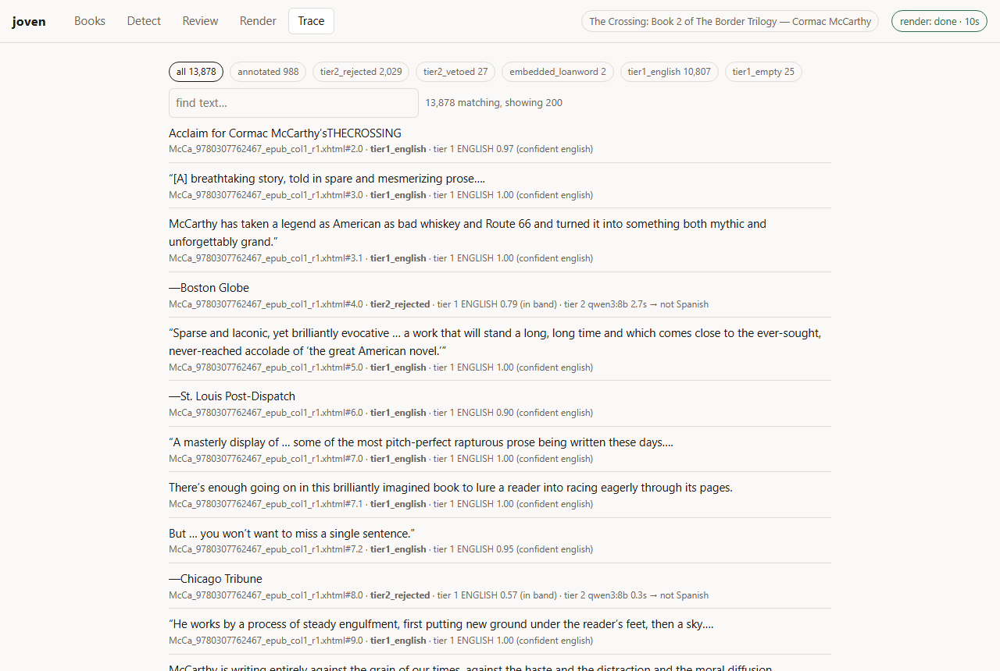
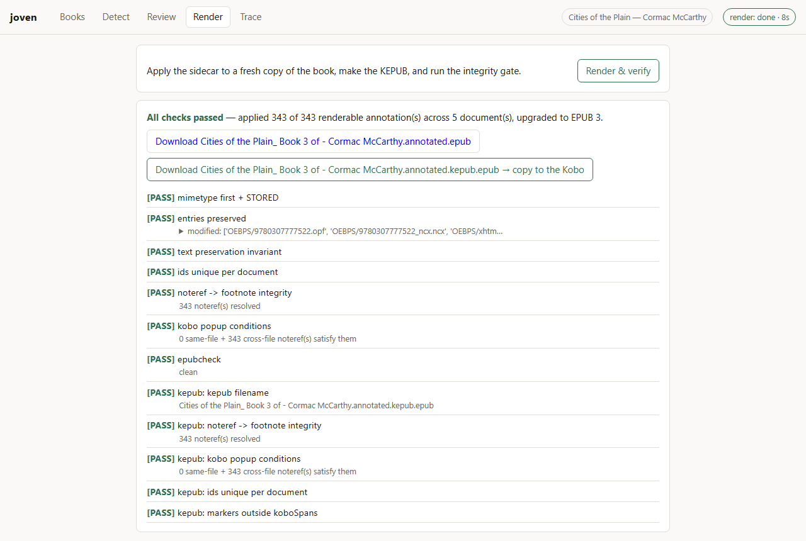

# The browser UI

The whole workflow in one local page: choose a book, detect, review, render,
verify, download. One command starts it:

```bash
joven ui
```

It opens `http://127.0.0.1:8770/` in your browser and stays running until Ctrl-C.
Every button calls exactly what the matching command calls — `detect()`,
`render_epub()`, `verify()` — so the page and the command line cannot drift apart,
and anything started here can be finished from the shell and vice versa.

<table>
<tr>
<td width="50%"></td>
<td width="50%"></td>
</tr>
<tr>
<td><em>Detect, with the progress the CLI shows and a Cancel that keeps everything answered so far.</em></td>
<td><em>Review, suspect passages first, with span editing for the one thing the command line could not fix.</em></td>
</tr>
<tr>
<td width="50%"></td>
<td width="50%"></td>
</tr>
<tr>
<td><em>Trace, which is <code>joven explain</code> as a page: filter by outcome, search, expand for the raw model reply.</em></td>
<td><em>Render &amp; verify, then download the KEPUB for the Kobo.</em></td>
</tr>
</table>

---

## Where the books go

A browser cannot hand a local server a path, so a dropped EPUB is **copied** into
a working directory keyed by its SHA-256, and everything the workflow derives from
it lives alongside:

```
~/.joven/books/<sha256>/
    <original filename>.epub    the book, never edited
    meta.json                   title, author, when it was added
    annotations.json            the sidecar the review page edits
    trace.jsonl                 the decision trace, flushed per record
    out/                        the rendered .epub and .kepub.epub
```

Dropping the same file twice finds the same directory; two editions of one title
never share a sidecar. A path box next to the drop zone takes a file already on the
machine, which is quicker for a large library. `--home` or `JOVEN_HOME` moves the
root. The files are ordinary: `joven review ~/.joven/books/<sha>/annotations.json`
works, and so does copying a sidecar you made on the command line into place.

## The tabs

**Books.** Drop or pick a file, then the same facts `joven inspect` prints: words,
paragraphs, EPUB version, metadata, the spine. A book that would be refused —
DRM, not a zip, no OPF — is refused here, before it takes up residence.

**Detect.** Backend, model, workers and an optional paragraph limit, defaulting to
your [configuration](configuration.md); the model box offers what the chosen server
lists. The run shows paragraphs done, escalations, footnotes so far and the last
model latency, then the same report the CLI prints. **Cancel** stops between
paragraphs and keeps every model answer already given: start again with *reuse
recorded answers* ticked and only the unreached paragraphs cost anything — the same
mechanism as `detect --resume`. One job runs at a time, because the model server is
the bottleneck either way.

**Review.** The review page, with everything `joven review` has — suspect
annotations first with the reason badged, the surrounding prose, `j`/`k`, `a`/`r`,
`e`, Ctrl-Enter — plus **span editing**: press `s` or *Edit span*, select the
Spanish with the mouse, and the marker moves. The selection is checked server-side
the way the renderer checks it, so a span outside the paragraph is refused rather
than rendered. Every decision writes straight to the sidecar.

**Render.** One button: apply the sidecar to a fresh copy of the book, make the
KEPUB if `kepubify` is on `PATH`, run the 12-check integrity gate on the result,
and offer both files for download. The KEPUB is the one to copy to the Kobo.

**Trace.** `joven explain` as a page. Outcome counts are filter chips; the search
box matches segment text and translations; a row expands to the Tier-1 score and
reason, the span, the translation, and the model's raw reply. This is where "why
is this line not annotated?" gets answered without `jq`.

## What it will not do

- **Leave the machine.** It binds to `127.0.0.1` only. Every request that changes
  anything carries a token the page was handed when it loaded, so a page open in
  another tab cannot post into this one, and downloads are served by name from the
  book's own `out/` directory and nowhere else.
- **Run two jobs at once.** The second is refused with a plain message.
- **Replace the command line.** It is the same functions with a different front;
  the CLI remains the primary interface and everything in
  [troubleshooting.md](troubleshooting.md) still applies to the files it writes.

## Why not a terminal UI

Reviewing 700 annotations means reading paragraphs of prose and editing free text,
which a browser does better than any terminal widget — and the review page already
existed, offline and dependency-free, on the standard library's HTTP server. The
rest of the workflow was a job runner and a few JSON routes on the same server; no
framework, no build step, one HTML file shipped inside the wheel.
